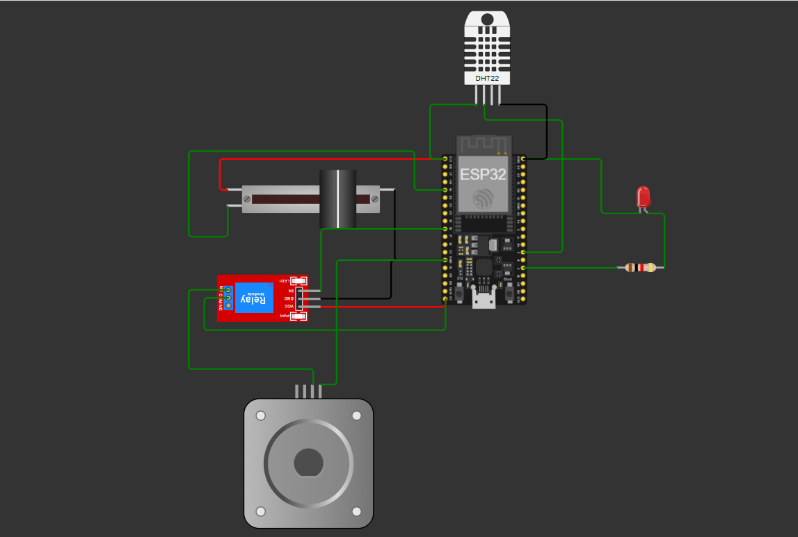
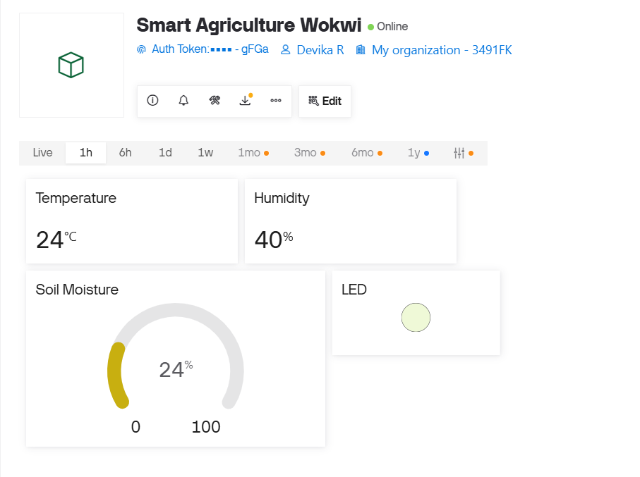
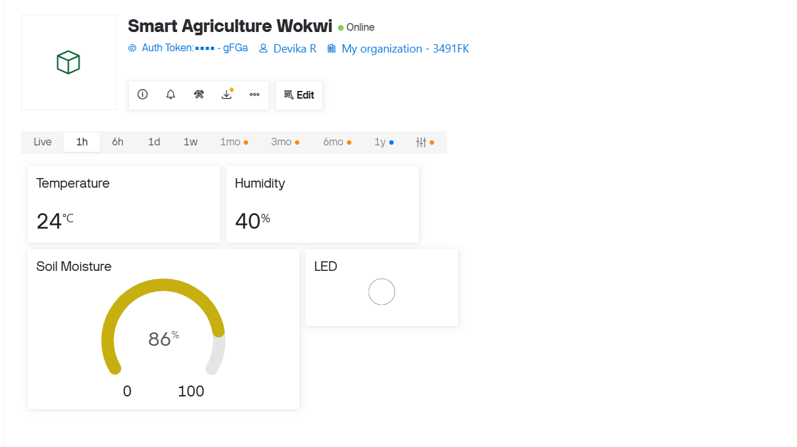

# Cognevance_IoT_SmartAgriculture

An IoT-Based Smart Agriculture Monitoring System developed using an ESP32/ESP8266 microcontroller and IoT sensors to monitor soil and environmental conditions in real time. The system collects soil moisture, temperature, and humidity data, sends the readings to a cloud-based IoT platform, and automatically controls irrigation based on soil moisture conditions.

## Project Overview

Agriculture requires regular monitoring of soil and environmental conditions to maintain healthy crop growth and use water efficiently.

This project implements an IoT-based smart agriculture monitoring system that continuously monitors:

* Soil moisture
* Temperature
* Humidity

The collected sensor data is transmitted through an ESP32/ESP8266 to an IoT cloud platform. A dashboard is used for real-time monitoring, while an automated irrigation system controls a water pump based on the soil moisture level.

## Objectives

The main objectives of this project are:

1. Monitor soil moisture, temperature, and humidity in real time.
2. Interface multiple sensors with an ESP32/ESP8266.
3. Transmit sensor data to an IoT cloud platform.
4. Create a dashboard for real-time monitoring.
5. Implement automatic irrigation control based on soil moisture.
6. Analyze the collected sensor data.
7. Test communication between the embedded device and IoT platform.
8. Test and verify the complete automation workflow.
9. Document the system architecture, implementation, and testing results.

## System Features

* Real-time soil moisture monitoring
* Temperature monitoring
* Humidity monitoring
* IoT cloud connectivity
* Real-time dashboard
* Automatic irrigation control
* Sensor-based decision making
* Remote monitoring
* Sensor data analysis
* Embedded system testing

## Hardware Components

| Component            | Purpose                                    |
| -------------------- | ------------------------------------------ |
| ESP32 / ESP8266      | Main microcontroller and IoT communication |
| Soil Moisture Sensor | Measures soil moisture level               |
| Temperature Sensor   | Measures temperature                       |
| Humidity Sensor      | Measures humidity                          |
| Relay Module         | Controls the irrigation pump               |
| Water Pump           | Supplies water to the plant                |
| Power Supply         | Provides power to the system               |
| Connecting Wires     | Circuit connections                        |

## Software and Technologies

* Embedded C / Arduino C++
* Arduino IDE
* ESP32 / ESP8266
* IoT Cloud Platform
* IoT Dashboard
* Serial Monitor
* Wi-Fi Communication

## Working Principle

1. The soil moisture sensor measures the moisture level of the soil.
2. The temperature sensor measures the surrounding temperature.
3. The humidity sensor measures environmental humidity.
4. The ESP32/ESP8266 reads the sensor values.
5. The microcontroller processes the sensor readings.
6. The sensor data is transmitted to the IoT cloud platform using Wi-Fi.
7. The dashboard displays the sensor readings in real time.
8. The soil moisture value is compared with a predefined threshold.
9. If the soil becomes sufficiently dry, the controller activates the relay.
10. The relay turns ON the water pump.
11. When the soil moisture reaches the required level, the pump is turned OFF.
12. The sensor values and irrigation status are continuously monitored.

## Circuit Diagram

The complete smart agriculture circuit consists of the microcontroller, soil moisture sensor, temperature/humidity sensor, relay module, and water pump.



## Data Analysis

Sensor readings can be analyzed to understand the relationship between soil moisture and irrigation requirements.

The following parameters can be analyzed:

| Parameter         | Purpose                           |
| ----------------- | --------------------------------- |
| Soil Moisture     | Determines irrigation requirement |
| Temperature       | Monitors environmental conditions |
| Humidity          | Monitors surrounding moisture     |
| Irrigation Status | Shows whether watering is active  |
| Pump Status       | Shows water pump operation        |

The collected data can be represented using tables or graphs to identify changes in soil and environmental conditions.

## Testing Results

| Test Case            | Expected Result              | Status |
| -------------------- | ---------------------------- | ------ |
| Soil moisture sensor | Correct moisture reading     | PASS   |
| Temperature sensor   | Correct temperature reading  | PASS   |
| Humidity sensor      | Correct humidity reading     | PASS   |
| Wi-Fi connection     | Device connects successfully | PASS   |
| Cloud communication  | Data reaches dashboard       | PASS   |
| Dashboard            | Real-time values displayed   | PASS   |
| Dry soil condition   | Pump turns ON                | PASS   |
| Wet soil condition   | Pump turns OFF               | PASS   |
| Complete automation  | System operates correctly    | PASS   |

#Wokwi Project
(https://wokwi.com/projects/472128409662077953)

# Smart Home Automation Dashboard

The Smart Home Automation system uses a **Blynk IoT dashboard** to monitor sensor readings and display the status of the automated lighting system.

## Dashboard – Light ON

The dashboard displays the system status when the motion and low-light conditions are satisfied and the automated light is ON.



## Dashboard – Light OFF

The dashboard displays the system status when the automated light is OFF.



---

## Dashboard Parameters

| Parameter | Virtual Pin | Description |
|---|---|---|
| Temperature | V0 | Displays temperature measured by the DHT22 sensor |
| Humidity | V1 | Displays humidity measured by the DHT22 sensor |
| Light Value | V2 | Displays the LDR light intensity value |
| Motion Status | V3 | Displays whether motion is detected by the PIR sensor |
| Relay Status | V4 | Displays the current relay state |
| Light Status | V5 | Displays whether the automated light is ON or OFF |

---

## Project Folder Structure

```text
Cognevance_IoT_SmartAgriculture/
│
├── README.md
│
├── src/
│   └── smart_agriculture.ino
│
├── circuit/
│   └── smart_agriculture_circuit.png
│
├── dashboard/
│   └── dashboard_screenshot.png
│
├── screenshots/
│   ├── sensor_readings.png
│   ├── irrigation_on.png
│   └── irrigation_off.png
│
├── testing/
│   └── testing_report.md
│
└── documentation/
    └── smart_agriculture.pdf
```
## Conclusion

The IoT-Based Smart Agriculture Monitoring System demonstrates how embedded systems and IoT technologies can be used for real-time agricultural monitoring and automated irrigation.

The system integrates soil moisture, temperature, and humidity sensing with an ESP32/ESP8266 and cloud-based monitoring. Based on soil moisture conditions, the irrigation system can automatically control the water pump, helping reduce manual effort and support efficient water management.
