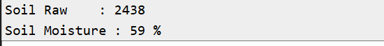

# Smart Agriculture System
## Testing Report

---

## 1. Introduction

The Smart Agriculture System was developed using ESP32 and tested using the Wokwi simulation environment.

The purpose of testing was to verify the correct operation of the soil moisture monitoring system, sensor readings, LED indication, relay control, and Blynk IoT dashboard.

The system monitors soil moisture and uses the sensor readings to determine the condition of the soil. Based on the defined threshold, the system controls the output automatically.

Blynk IoT is used to display real-time sensor readings and system status.

---

## 2. Testing Objectives

The main objectives of testing were:

- To verify ESP32 operation.
- To verify soil moisture sensor readings.
- To verify analog sensor input.
- To verify soil moisture threshold detection.
- To verify LED operation.
- To verify relay operation.
- To verify automatic control logic.
- To verify Serial Monitor output.
- To verify Blynk IoT connectivity.
- To verify real-time dashboard readings.
- To verify the complete system through Wokwi simulation.

---

## 3. Testing Environment

| Parameter | Details |
|---|---|
| Microcontroller | ESP32 DevKit |
| Simulation Platform | Wokwi |
| Soil Moisture Sensor | Potentiometer / Soil Moisture Simulation |
| Actuator | Relay Module |
| Indicator | LED |
| IoT Platform | Blynk IoT |
| Programming | Embedded C/C++ |

---

## 4. Component Testing

### 4.1 ESP32 Testing

The ESP32 was tested to verify that it initializes correctly and executes the programmed control logic.

**Expected Result:**

The ESP32 should start successfully and continuously process the sensor readings.

**Result:**

PASS

---

### 4.2 Soil Moisture Sensor Testing

The soil moisture sensor was tested by changing the simulated sensor value.

The sensor provides an analog value to the ESP32.

**Expected Result:**

The ESP32 should correctly read the changing soil moisture value.

**Result:**

PASS



---

### 4.3 LED Testing

The LED was tested as a visual indication of the system condition.

**Expected Result:**

The LED should change according to the programmed soil moisture condition.

**Result:**

PASS

---

### 4.4 Relay Testing

The relay was tested to verify automatic control based on soil moisture conditions.

**Expected Result:**

The relay should switch according to the defined soil moisture threshold.

**Result:**

PASS

---

## 5. Soil Moisture Testing

The soil moisture value was varied in the Wokwi simulation to test different soil conditions.

The system compares the sensor value with the programmed threshold.

Example:

```text
Soil Moisture Condition
          ↓
Read Sensor Value
          ↓
Compare with Threshold
          ↓
Automatic Decision
